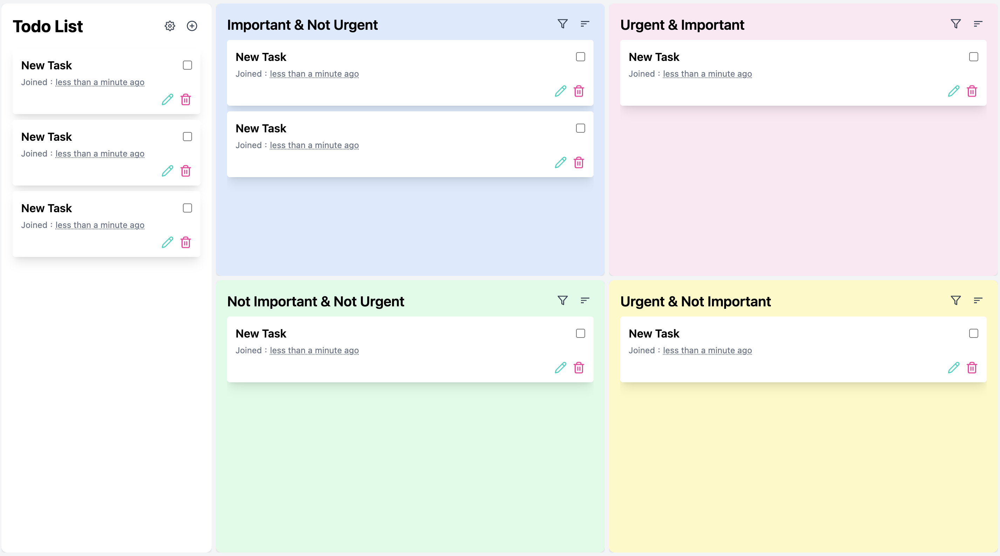
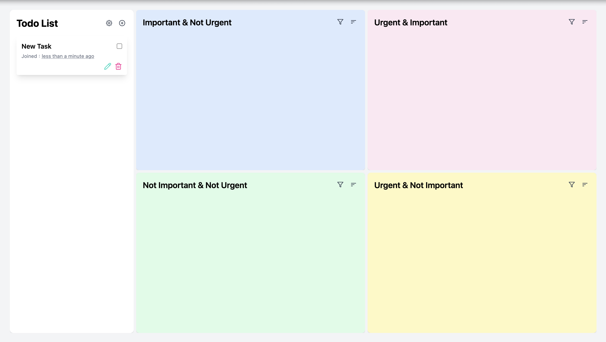
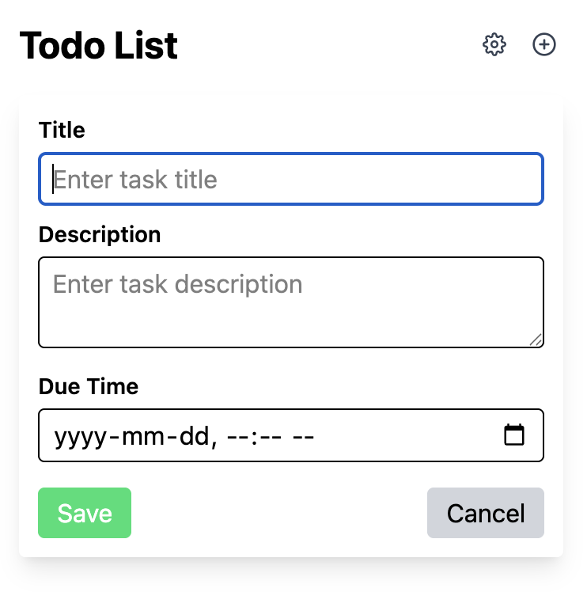
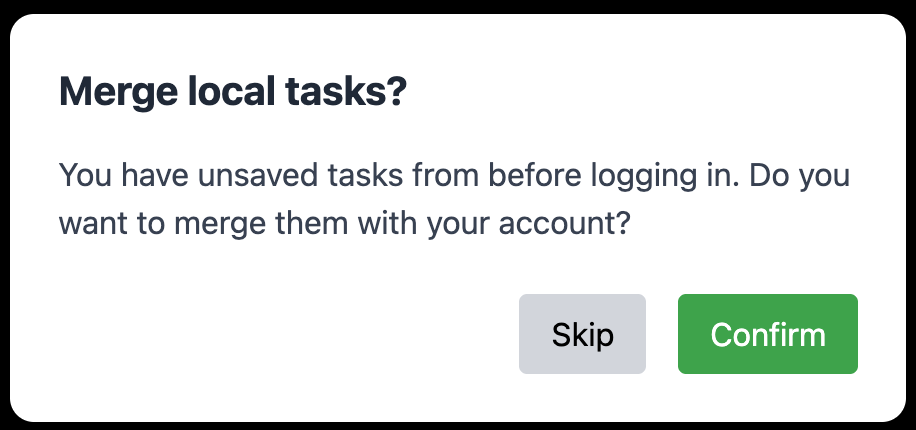
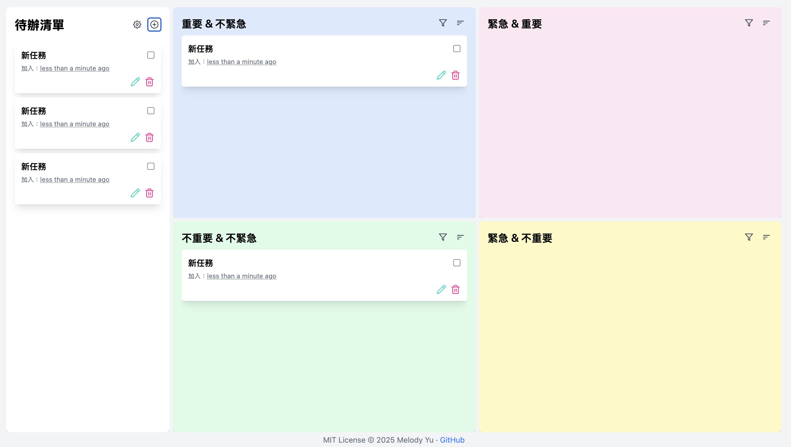
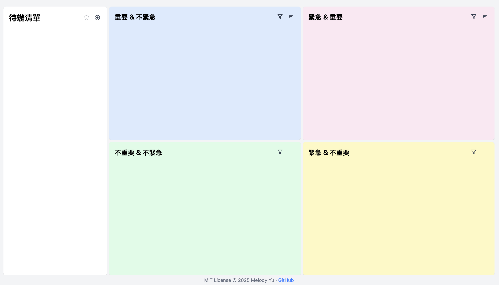
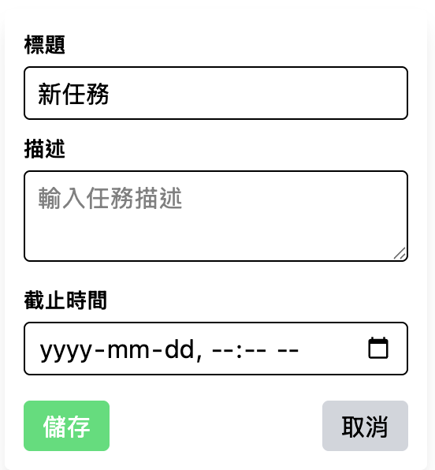

# 🌟 [Quadrant Task Manager](https://todo-quadrant-app.vercel.app)

> A productivity-focused **Eisenhower Matrix** style to-do list web app.



## 📌 Overview

This web app helps you manage tasks using the **Eisenhower Matrix** — a 2x2 quadrant system categorizing tasks by **importance** and **urgency**.

### ✅ Why the Eisenhower Matrix?

It helps you:

- Focus on what truly matters
- Reduce time wasted on distractions
- Plan long-term by separating **important** from **urgent**

## 🛠️ Tech Stack

- **Frontend**: React, Vite, Tailwind CSS, React DnD, i18next
- **Backend**: Java + Spring Boot ([View on GitHub](https://github.com/Melodieeee/todo-quadrant-app-back))
- **Authentication**: Google OAuth2
- **Database**: MongoDB Atlas
- **Deployment**:
  - Frontend: [Vercel](https://vercel.com)
  - Backend: [Render](https://render.com)

## 🧪 CI/CD

This project uses **GitHub Actions** to automatically lint, format-check, and build the frontend, with LINE bot notifications for build results.
The frontend is **automatically deployed via Vercel** on every push to the `main` branch, completing a full CI/CD workflow.

### ✅ CI Steps:

- Install dependencies (`npm ci`)
- Lint with ESLint (`npm run lint`)
- Format check with Prettier (`npm run format:check`)
- Build app (`npm run build`)
- Notify success/failure via LINE Bot
- 🔁 **Vercel automatically deploys latest commit on `main`**

📄 View the workflow config:
[`frontend-ci.yml`](.github/workflows/frontend-ci.yml)

> Remember to set these secrets in **GitHub → Settings → Secrets**:
>
> - `LINE_CHANNEL_ACCESS_TOKEN`
> - `LINE_USER_ID`

## 🔐 Usage

- You can use the app **without logging in** — tasks will be stored locally and lost on refresh
- **Log in with Google** to save tasks to the cloud

## 🧩 Features

- Five task sections:
  - Inbox (Uncategorized)
  - Important + Urgent
  - Important + Not Urgent
  - Not Important + Urgent
  - Not Important + Not Urgent
- **Draggable & resizable quadrant layout**
- **Double-click** a quadrant to expand/focus view
- **Double-click** a task to edit/save
- **Drag and drop** tasks across quadrants or reorder within
- Sort and filter by **due date**, **creation time**, or **completion status**
- Tasks sync with backend if logged in

## 📸 Screenshots

### 🔲 Main View



### ✏️ Task Editing



### 🔄 Merge Prompt on Login



## ⚙️ Getting Started

```bash
npm install
npm run dev
```

### `.env.local` example

```
# Use Render backend in production
# VITE_BACKEND_URL=https://todo-quadrant-app-back.onrender.com

# Use local backend for development
VITE_BACKEND_URL=http://localhost:8080
```

### Vite Proxy Setup (`vite.config.js`)

```js
import { defineConfig } from 'vite';
import react from '@vitejs/plugin-react';
import tailwindcss from '@tailwindcss/vite';

export default defineConfig({
  plugins: [react(), tailwindcss()],
  server: {
    proxy: {
      '/api': {
        target: 'http://localhost:8080',
        changeOrigin: true,
        secure: false,
      },
      '/oauth2': {
        target: 'http://localhost:8080',
        changeOrigin: true,
        secure: false,
      },
    },
  },
});
```

## 🗺️ Roadmap

### ✅ Completed

- [x] Drag and drop tasks into quadrants
- [x] Google OAuth2 login
- [x] Bilingual language switch (i18n)
- [x] Filter for completed / expired tasks
- [x] Task sorting (by creation date / due date)
- [x] Responsive layout for mobile and tablet

### 🚧 In Progress / Planned

- [ ] Task search and filtering
- [ ] Tag support for categorization
- [ ] Dark mode & theme customization

## 📬 License

MIT License © 2025 Melody Yu

---

# 🌟 [四象限任務管理器](https://todo-quadrant-app.vercel.app)

> 一個以 **艾森豪矩陣（Eisenhower Matrix）** 為基礎的任務管理工具



## 📌 概覽

這是基於網頁的任務管理應用程式，使用四象限（重要 x 緊急）原則，幫助你有條理地安排生活與工作。

### ✅ 為什麼使用四象限？

- 專注在真正重要的事
- 減少時間浪費
- 清楚區分長遠規劃與即時反應

## 🛠️ 技術堆疊

- **前端**：React、Vite、Tailwind CSS、React DnD、i18next
- **後端**：Java + Spring Boot ([GitHub 連結](https://github.com/Melodieeee/todo-quadrant-app-back))
- **登入系統**：Google OAuth2
- **資料庫**：MongoDB Atlas
- **部署平台**：
  - 前端：[Vercel](https://vercel.com)
  - 後端：[Render](https://render.com)

## 🧪 CI/CD | 自動化建置流程

本專案整合 **GitHub Actions** 進行前端程式的自動化建置與檢查，並使用 **LINE Bot 通知功能** 提醒開發者建置成功或失敗。
前端則透過 **Vercel** 自動部署至最新版本，實現完整 CI/CD 流程。

### ✅ 自動化流程內容：

- 安裝依賴（`npm ci`）
- Lint 檢查（`npm run lint`）
- 格式檢查（`npm run format:check`）
- 編譯建置（`npm run build`）
- 成功或失敗後透過 LINE 通知開發者
- 🔁 **每次 push 到 main 分支後，Vercel 自動部署前端**

📄 前端 CI workflow 檔案請參考：
[`frontend-ci.yml`](.github/workflows/frontend-ci.yml)

> 你需要在 GitHub 專案的 **Settings → Secrets** 中設定下列機密值：
>
> - `LINE_CHANNEL_ACCESS_TOKEN`
> - `LINE_USER_ID`

## 🔐 使用方式

- **不登入**：任務將暫存於本機，重新整理即會消失
- **登入 Google 帳號**：可將任務儲存至雲端，跨裝置同步

## 🧩 功能特色

- 支援五大區塊分類：
  - 收件匣（未分類）
  - 重要且緊急
  - 重要但不緊急
  - 不重要但緊急
  - 不重要也不緊急
- 任務可自由拖拉移動、調整順序、雙擊編輯
- 四象限版面可調整大小，雙擊可放大檢視
- 支援依到期日、建立時間、完成狀態進行排序
- 若已登入，所有動作將同步更新後端

## 📸 畫面截圖

### 🔲 主畫面



### ✏️ 任務編輯畫面



### 🔄 登入後合併提示


## ⚙️ 開發指南

```bash
npm install
npm run dev
```

### `.env.local` 範例

```
# 使用 Render 上的後端
# VITE_BACKEND_URL=https://todo-quadrant-app-back.onrender.com

# 開發時使用本地後端
VITE_BACKEND_URL=http://localhost:8080
```

### Vite 代理設定 (`vite.config.js`)

```js
import { defineConfig } from 'vite';
import react from '@vitejs/plugin-react';
import tailwindcss from '@tailwindcss/vite';

export default defineConfig({
  plugins: [react(), tailwindcss()],
  server: {
    proxy: {
      '/api': {
        target: 'http://localhost:8080',
        changeOrigin: true,
        secure: false,
      },
      '/oauth2': {
        target: 'http://localhost:8080',
        changeOrigin: true,
        secure: false,
      },
    },
  },
});
```

## 🗺️ 開發藍圖（Roadmap）

### ✅ 已完成功能

- [x] 任務可在象限間拖拉排序
- [x] Google OAuth2 登入
- [x] 支援中英雙語切換
- [x] 任務完成 / 過期狀態篩選
- [x] 任務排序（建立時間 / 到期日）
- [x] 手機與平板裝置的 RWD 響應式排版

### 🚧 計畫開發中功能

- [ ] 任務搜尋與篩選功能
- [ ] 支援任務標籤分類
- [ ] 深色模式與主題自定義

## 📬 License

MIT License © 2025 Melody Yu
